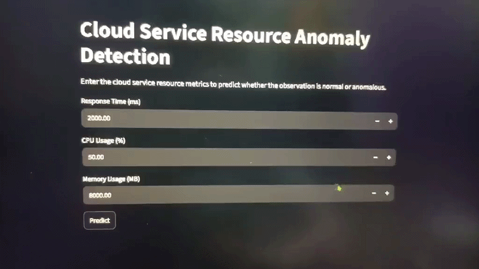

# Cloud Service Resource Anomaly Classification




## 1. Project Overview

This project develops a machine learning system for detecting unusual resource-usage observations in a simulated cloud-service environment.

The system classifies each observation as either:

* **Normal**
* **Anomalous**

The project uses cloud service performance metrics such as response time, CPU usage, and memory usage to identify unusual operating patterns.

This is an educational prototype and is not intended for production cloud monitoring.

## 2. Problem Statement

Cloud services generate resource and performance measurements continuously. Unusual patterns in these measurements may indicate abnormal operating conditions.

The objective of this project is to investigate whether resource and performance metrics can be used to distinguish normal observations from anomalous observations.

## 3. Dataset

The dataset contains 200 simulated cloud-service observations.

### Features

* `response_time_ms` — service response time in milliseconds
* `cpu_usage_percent` — CPU utilization percentage
* `memory_usage_mb` — memory usage in megabytes

Additional contextual fields in the dataset include:

* `timestamp`
* `service_name`
* `log_level`
* `region`

The original `anomaly_type` field was used to create the binary target:

* `0` — Normal
* `1` — Anomalous

The dataset contains 131 normal and 69 anomalous observations.

## 4. Methodology

The project followed these main steps:

1. Dataset inspection
2. Data quality checking
3. Exploratory Data Analysis (EDA)
4. Binary target creation
5. Train-test splitting
6. Feature preprocessing
7. Model training
8. Model evaluation
9. Error analysis
10. Final model selection
11. Streamlit prototype development

The dataset was divided into 80% training data and 20% testing data using stratified sampling.

## 5. Models Tested

Three foundational machine learning models were evaluated:

* Logistic Regression
* Decision Tree
* K-Nearest Neighbors (KNN)

The final prototype uses a **Decision Tree** based on its performance on the selected test split and its interpretability.

## 6. Final Model Results

Using the three core features — response time, CPU usage, and memory usage — the final Decision Tree achieved:

| Metric    | Result |
| --------- | -----: |
| Accuracy  |  65.0% |
| Precision |  50.0% |
| Recall    |  42.9% |
| F1 Score  |  46.2% |
| ROC-AUC   |  59.9% |

The confusion matrix was:

```text
[[20, 6],
 [ 8, 6]]
```

The results indicate that the resource metrics contain some useful information for anomaly detection, but the classes have considerable overlap.

## 7. Feature Importance

The Decision Tree feature importance values were:

| Feature       | Importance |
| ------------- | ---------: |
| CPU Usage     |      43.8% |
| Response Time |      31.9% |
| Memory Usage  |      24.3% |

These values describe how much the Decision Tree used each feature when making its splits. They should not be interpreted as causal relationships.

## 8. Error Analysis

The final model produced both false positives and false negatives.

This indicates that some normal observations can have resource patterns that appear unusual, while some anomalous observations can have resource values similar to normal observations.

Therefore, no single resource metric was sufficient to perfectly separate normal and anomalous observations.

## 9. Streamlit Application

A simple Streamlit application was developed as the project prototype.

The user enters:

* Response Time
* CPU Usage
* Memory Usage

The application returns:

* Normal or Anomalous prediction
* Estimated anomaly probability

## 10. Project Structure

```text
cloud-anomaly-classification/
│
├── dataset/
│   └── dataset.csv
│
├── notebooks/
│   ├── analysis.ipynb
│   ├── final_model.pkl
│   └── app.py
│
├── requirements.txt
└── README.md
```

## 11. Installation

Create and activate a Python virtual environment, then install the required packages:

```bash
pip install -r requirements.txt
```

## 12. Running the Application

Navigate to the folder containing `app.py` and run:

```bash
streamlit run app.py
```

The Streamlit application will open in the browser.

## 13. Limitations

* The dataset contains only 200 observations.
* The data represents a simulated cloud-service environment.
* The model was evaluated using a single train-test split.
* The final model has limited predictive performance.
* The anomaly probability produced by the Decision Tree should be treated as a model estimate rather than a calibrated real-world risk probability.

## 14. Future Scope

Future work could include:

* Collecting larger and more realistic cloud monitoring datasets
* Including additional metrics such as request rate and network throughput
* Testing temporal patterns using longer time-series data
* Exploring more advanced anomaly detection methods
* Evaluating the system on real cloud-service monitoring data

## 15. Conclusion

This project demonstrates an end-to-end machine learning workflow for classifying cloud-service resource observations as normal or anomalous.

Exploratory analysis, model comparison, evaluation, error analysis, and a Streamlit prototype were used to develop and demonstrate the system. The results show that CPU usage, response time, and memory usage provide some information for distinguishing anomalous observations, while also showing the limitations of a small simulated dataset.
